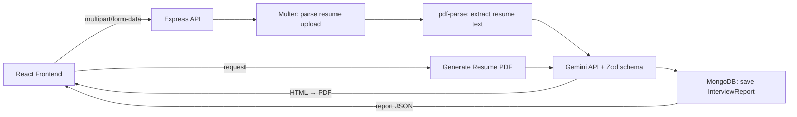

<div align="center">

# 🎯 AI Interview Generator

**Upload your resume, paste a job description, and let AI build your personalized interview prep — questions, skill gaps, and a day-by-day roadmap.**

[](https://nodejs.org/)
[](https://react.dev/)
[](https://www.mongodb.com/)
[](https://ai.google.dev/)
[](#license)

[Features](#-features) • [Tech Stack](#-tech-stack) • [Architecture](#-architecture) • [Getting Started](#-getting-started) • [API Reference](#-api-reference) • [Roadmap](#-roadmap)

</div>

---

## 📖 Overview

**AI Interview Generator** is a full-stack web app that turns a resume + job description into a tailored interview prep report. Powered by Google's Gemini API, it analyzes the match between a candidate's background and a target role, then generates:

- 🎯 A **match score** (0–100)
- 💻 **10 technical questions**, tailored to the role
- 🗣️ **5 behavioral questions**
- 🧩 **Identified skill gaps**, with severity ratings
- 🗓️ A **7-day preparation roadmap**
- 📄 An **AI-tailored, ATS-friendly resume PDF** for the specific job

<br>

<details>
<summary><strong>📸 Screenshots</strong> (click to expand)</summary>
<br>

> _Add screenshots or a demo GIF here — e.g. the upload screen, the interview report view, and the roadmap tab._

```
/screenshots
  ├── home.png
  ├── report-technical.png
  ├── report-roadmap.png
```

</details>

---

## ✨ Features

| | |
|---|---|
| 📄 **Resume Parsing** | Extracts text directly from uploaded PDF resumes server-side |
| 🤖 **AI-Generated Reports** | Structured, schema-validated output from Gemini (via Zod) |
| 🎯 **Match Scoring** | Quantifies how well a resume aligns with a job description |
| 🧠 **Technical & Behavioral Prep** | Realistic, role-specific interview questions with model answers |
| 🗺️ **Personalized Roadmap** | Day-by-day study plan focused on closing skill gaps |
| 📑 **Tailored Resume Generation** | One-click AI-rewritten, ATS-friendly resume as a downloadable PDF |
| 🔐 **Authenticated & Private** | JWT-based auth — every report is scoped to its owner |
| 🕘 **Report History** | Revisit any previously generated report from your dashboard |

---

## 🛠️ Tech Stack

<table>
<tr>
<td valign="top" width="50%">

### Frontend
- **React** — component-driven UI
- **React Router** — client-side routing (`/`, `/interview/:id`, auth pages)
- **Context API** — global interview/report state
- **SCSS** — dark-themed, responsive styling
- **Axios** — HTTP client with `multipart/form-data` uploads

</td>
<td valign="top" width="50%">

### Backend
- **Node.js + Express** — REST API
- **MongoDB + Mongoose** — data persistence
- **Multer** — resume (PDF) upload handling
- **pdf-parse** — server-side resume text extraction
- **`@google/genai`** — Gemini API client (`gemini-2.5-flash`)
- **Zod** — structured, schema-validated AI output
- **JWT** — stateless authentication

</td>
</tr>
</table>

---

## 🏗️ Architecture



<details>
<summary><strong>📁 Project Structure</strong> (click to expand)</summary>

```
Backend/
├── src/
│   ├── config/
│   ├── controllers/
│   │   ├── auth.controller.js
│   │   └── interview.controller.js
│   ├── middlewares/
│   │   ├── auth.middleware.js
│   │   └── file.middleware.js
│   ├── models/
│   │   ├── blacklist.model.js
│   │   ├── interviewReport.model.js
│   │   └── user.model.js
│   ├── routes/
│   │   ├── auth.routes.js
│   │   └── interview.routes.js
│   └── services/
│       └── ai.services.js
├── server.js
└── .env

Frontend/
├── src/
│   ├── features/
│   │   ├── auth/
│   │   │   ├── componenents/Protected.jsx
│   │   │   └── pages/{LogIn,Register}.jsx
│   │   └── interview/
│   │       ├── hook/useInterview.js
│   │       ├── pages/{Home,Interview}.jsx
│   │       ├── services/interview.api.js
│   │       └── style/{home,interview}.scss
│   └── router.jsx
```

</details>

---

## 🚀 Getting Started

### Prerequisites
- Node.js ≥ 18
- MongoDB (local or Atlas)
- A [Google AI Studio](https://aistudio.google.com/app/apikey) API key for Gemini

### 1. Clone the repo
```bash
git clone https://github.com/m270803/<repo-name>.git
cd <repo-name>
```

### 2. Backend setup
```bash
cd Backend
npm install
```

Create a `.env` file:
```env
PORT=3000
MONGODB_URI=your_mongodb_connection_string
JWT_SECRET=your_jwt_secret
GOOGLE_GENAI_API_KEY=your_gemini_api_key
```

Run the server:
```bash
npm run dev
```

### 3. Frontend setup
```bash
cd ../Frontend
npm install
npm run dev
```

The app should now be running at `http://localhost:5173`, talking to the API at `http://localhost:3000`.

---

## 📡 API Reference

<details>
<summary><strong>Auth</strong></summary>

| Method | Endpoint | Description | Access |
|---|---|---|---|
| `POST` | `/api/auth/register` | Register a new user | Public |
| `POST` | `/api/auth/login` | Log in, receive JWT | Public |

</details>

<details>
<summary><strong>Interview Reports</strong></summary>

| Method | Endpoint | Description | Access |
|---|---|---|---|
| `POST` | `/api/interview/` | Upload resume + JD, generate a new report | Private |
| `GET` | `/api/interview/` | Get all reports for the logged-in user | Private |
| `GET` | `/api/interview/report/:interviewId` | Get a single report by ID | Private |
| `POST` | `/api/interview/:interviewId/resume` | Generate a tailored resume PDF | Private |

**Example — generate a report**
```bash
curl -X POST http://localhost:3000/api/interview/ \
  -H "Cookie: token=<jwt>" \
  -F "resume=@resume.pdf" \
  -F "jobDescription=Backend Engineer role focused on Node.js and MongoDB" \
  -F "selfDescription=3 years experience building REST APIs..."
```

</details>

---

## 🗺️ Roadmap

- [x] Resume upload + AI report generation
- [x] Match score, technical/behavioral questions, skill gaps
- [x] 7-day preparation roadmap
- [x] AI-tailored resume PDF export


---

## 🤝 Contributing

Contributions, issues, and feature requests are welcome!

1. Fork the project
2. Create your feature branch (`git checkout -b feature/amazing-feature`)
3. Commit your changes (`git commit -m 'Add amazing feature'`)
4. Push to the branch (`git push origin feature/amazing-feature`)
5. Open a Pull Request

---

## 📄 License

Distributed under the MIT License. See `LICENSE` for more information.

---

<div align="center">

Built by **[Mehul](https://github.com/m270803)**

</div>
